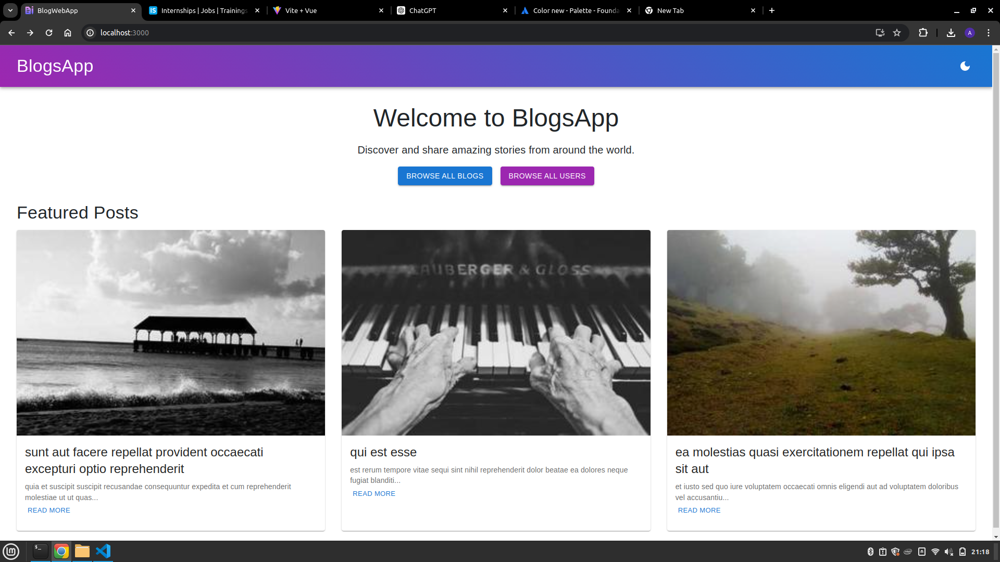
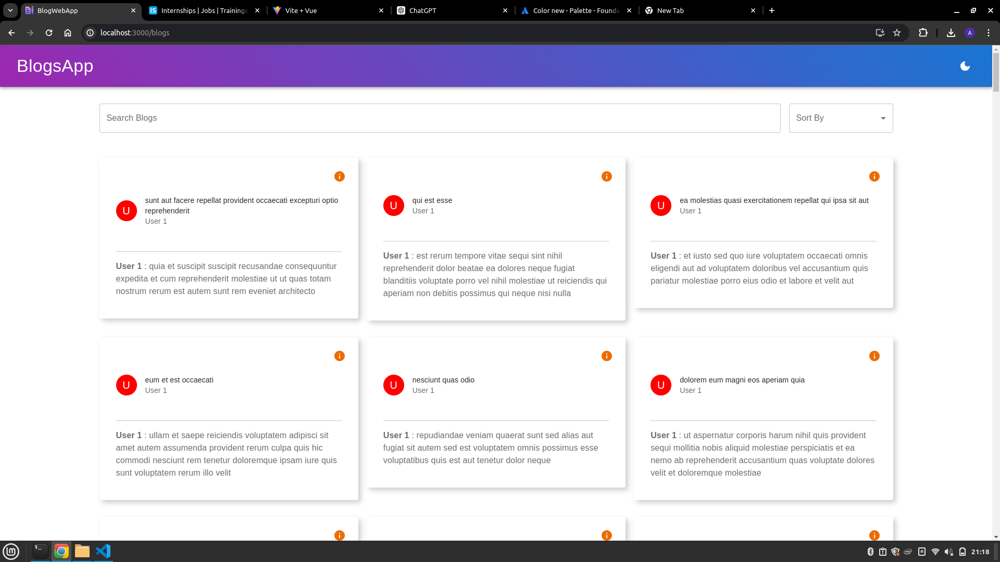
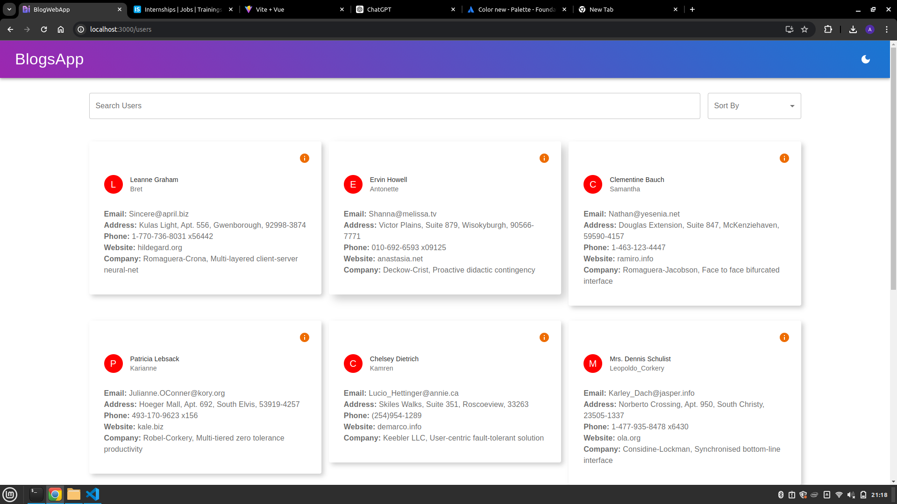

# Blog App using MERN Stack

Welcome to the Blog Web App! This application is built using the MERN (MongoDB, Express, React, Node.js) stack.

## Screenshots







## Getting Started

To get started with this project, follow these steps:

1. Fork this repository

1. Clone this repository to your local machine:

```bash
git clone [https://github.com/Aditi07hooda/BlogWebApp.git](https://github.com/Aditi07hooda/BlogWebApp.git)
```

2. Install the required dependencies for both the backend and frontend:

```bash
cd BlogWebApp
cd client && npm install
```
3. Start the frontend application:

```bash
cd client && npm start
```

4. Access the application in your web browser at [http://localhost:3000](http://localhost:3000).
